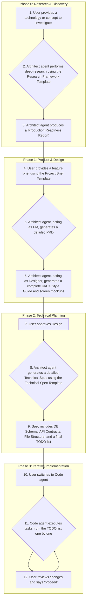

# The Roo V2 AI-Assisted Development Workflow

## 1. Overview

The Roo V2 Workflow is a state-of-the-art, multi-modal process designed to guide developers and AI agents from a raw idea to a production-ready feature with maximum efficiency and quality. It replaces the previous linear workflow with an iterative, four-phase approach that emphasizes research, design, and detailed technical planning before any code is written.

This workflow leverages specialized agent modes (`architect`, `designer`, `code`) to ensure expert-level output at each distinct phase, minimizing ambiguity and rework.

## 2. The Four Phases of Roo V2

The workflow is broken down into four distinct phases. Do not proceed to the next phase until the current one is complete and its artifacts are approved.

---

## 3. Phase 0: Research & Discovery

**Goal:** To deeply understand a new technology, library, or framework before committing to it. This phase prevents naive implementations and surfaces potential pitfalls early.

*   **Trigger:** When a project requires a technology that the team is not already expert in.
*   **Agent Mode:** `🏗️ Architect`
*   **Input:** A technology name (e.g., "WebSockets," "Temporal," "LangGraph").
*   **Process:**
    1.  The user requests research on a specific technology.
    2.  The `architect` agent uses the `templates/research_framework_template.md` to conduct a thorough investigation.
    3.  The agent hunts for production post-mortems, failure cases, and common "gotchas."
*   **Output:** A `Production_Readiness_Report.md` that provides a clear "Adopt," "Adapt," or "Avoid" recommendation with detailed justification.

---

## 4. Phase 1: Product & Design

**Goal:** To translate a feature idea into a concrete product definition and a complete visual design.

*   **Trigger:** A new feature idea or business requirement.
*   **Agent Mode:** `🏗️ Architect` (acting as both PM and Designer)
*   **Process:**
    1.  **Product Definition:** The user fills out `templates/project_brief_template_v2.md`. The `architect` agent uses this to generate a comprehensive **Product Requirements Document (PRD.md)**.
    2.  **Design System:** The agent uses `templates/style_guide_prompt.md` to create a `style_guide.md`, defining the application's visual language (colors, typography, spacing).
    3.  **Screen Design:** The agent uses `templates/screen_design_prompt.md` and the new style guide to create detailed, state-by-state `screen_mockups.md` for all required UI.
*   **Output:**
    *   `PRD.md`
    *   `style_guide.md`
    *   `screen_mockups.md`

---

## 5. Phase 2: Technical Planning

**Goal:** To create a detailed, unambiguous engineering blueprint before a single line of code is written. This is the most critical step for ensuring a smooth implementation.

*   **Trigger:** User approval of the artifacts from Phase 1.
*   **Agent Mode:** `🏗️ Architect`
*   **Process:**
    1.  The `architect` agent is tasked with creating a full technical plan.
    2.  The agent uses `templates/technical_spec_template.md` as its guide.
    3.  The agent synthesizes the `PRD.md` and `screen_mockups.md` to produce a complete technical specification.
*   **Output:** A `technical_spec.md` containing:
    *   The final frontend and backend file structure.
    *   Database schema with table definitions, columns, types, and relationships.
    *   A full list of API endpoints with request/response contracts.
    *   A detailed, step-by-step `TODO.md` list for the implementation phase.

---

## 6. Phase 3: Iterative Implementation

**Goal:** To execute the technical plan efficiently and accurately.

*   **Trigger:** User approval of the `technical_spec.md`.
*   **Agent Mode:** `💻 Code`
*   **Process:**
    1.  The user switches to the `code` agent.
    2.  The `code` agent is instructed to follow the `TODO.md` generated in Phase 2.
    3.  The agent uses the `update_todo_list` tool to mark its progress, executing one task at a time.
    4.  The user reviews the code changes after each step and provides a `proceed` command to continue to the next task.
    5.  This loop continues until all tasks in the `TODO.md` are complete.
*   **Output:** A fully implemented feature that matches the design and technical specifications.